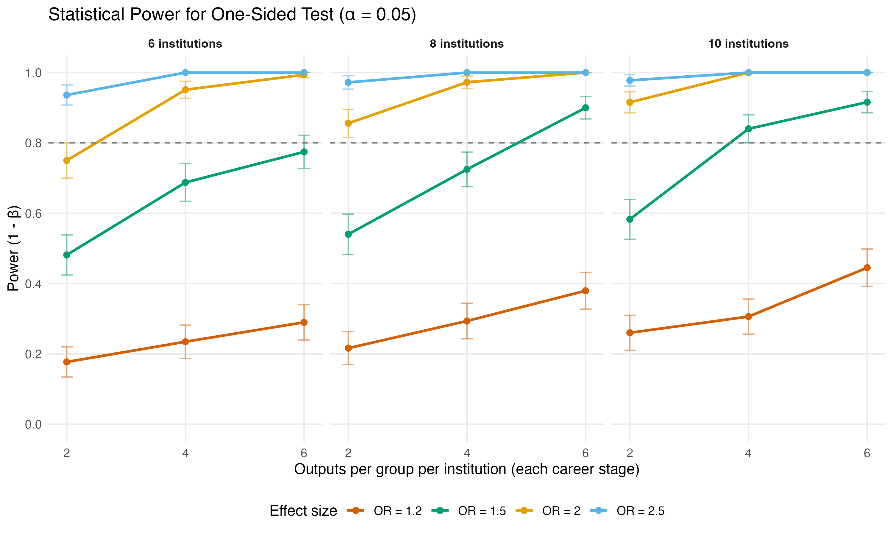
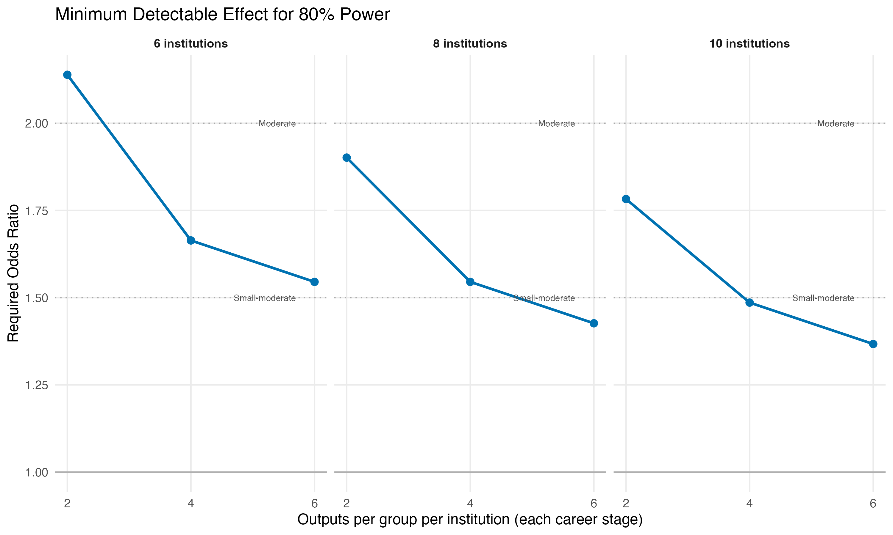
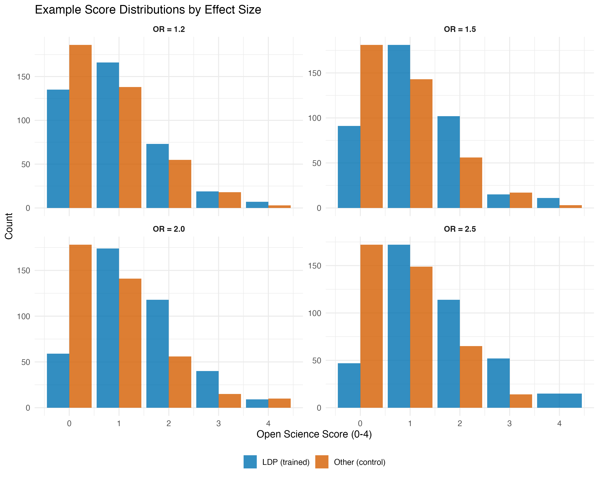
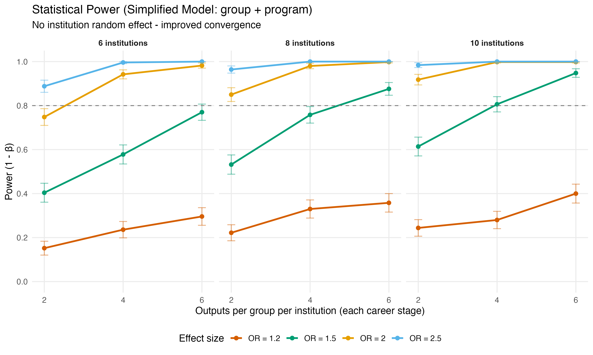
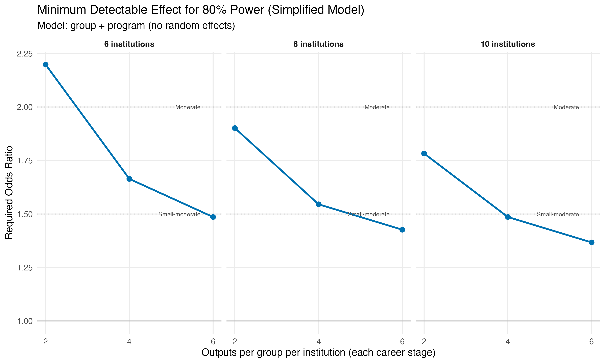

# Overview

This document describes the pre-registered design and analysis plan for evaluating whether formal training in open science practices is associated with higher rates of open science practice adoption in published research outputs.

## Research Question

Does training in open science practices (through the Living Data Project courses) lead to higher open science practice adoption rates in subsequent research publications, compared to researchers without such training?

## Study Design

Matched-groups observational study comparing open science indicators in publications authored by students who completed LDP training versus matched controls without such training.

# Variables and Definitions

## Response Variable: Open Science Score

The response variable is an **ordinal score** (0-4) representing the number of open science practices implemented in a publication:

- **Data sharing**: Research data deposited in repositories
- **Code sharing**: Analysis code made publicly available
- **Preprint sharing**: Manuscript posted as preprint
- **Study registration**: Study pre-registered 

These represent four of the five indicators used by PLOS in their [Open Science Indicators project](https://plos.figshare.com/articles/dataset/PLOS_Open_Science_Indicators/21687686). Their "protocol sharing" indicator is most relevant for bench sciences.  It is therefore excluded from this study, which focuses on ecology/evolution/environment (EEE) research.

**Variable type:** Ordered factor with levels 0, 1, 2, 3, 4

## Primary Independent Variable: Training Group

- **LDP**: Student completed Living Data Project training
- **Other**: Matched control student without LDP training

**Variable type:** Binary categorical (fixed effect in model)

## Blocking Variables

- **Institution**: Academic institution where degree was completed
- **Program level**: MSc or PhD

These are combined to create **stratum** (e.g., "UBC_MSc"), treated as random effects in the model.

*** 

# Hypotheses

## Null and Alternative Hypotheses

**H₀:** The odds of achieving a higher open science score are equal between LDP and control students, conditional on institution and career stage. (OR = 1)

**Hₐ:** The odds of achieving a higher open science score are higher for LDP students compared to controls, conditional on institution and career stage. (OR > 1)

## Statistical Test

One-sided Wald test at α = 0.05 on the group coefficient from the cumulative link mixed model.

**Justification for one-sided test:** There is no theoretical basis for expecting that training in open science practices would decrease the adoption of open science practices to a level lower than observed the general population of recently graduated EEE students.

*** 

# Study Design

## Sampling Strategy

See main pre-registration document

**Sample size determination:**

- Total N determined by number of distinct LDP student authors with published first-author research articles
- For each institution **_I_** and program level **_P_** (MSc/PhD):
  - Count distinct LDP student authors: n_LDP(*I*,*P*)
  - Sample equal number of control students: n_Other(*I*,*P*) = n_LDP(*I*,*P*)
- Stratum = Institution × Program level

**Matching criteria:**

- Same institution
- Same program level (MSc vs PhD)
- Similar graduation years (indicated by the year of deposit of gradate degree thesis) (2022-2024)

## Handling Multiple Publications

Some students may have published multiple papers. We are unlikely to have sufficient sample sizes to accommodate another random factor in the model (e.g. "student_id") to account for this.  Instead, and to avoid pseudo-replication, for each student author we will randomly select ONE publication for inclusion in the study.  We will acknowledge this limitation up front.  We will use the same strategy for the comparator group.

## Exclusion Criteria

LDP publications must have available matched controls from the same institution and program level. If insufficient controls exist at a stratum, LDP observations from that stratum will be excluded (determined by random selection).

*** 

# Analysis Plan

## Statistical Model

**Cumulative link mixed model** (proportional odds model) with logit link:

```
score ~ group + (1|stratum)
```

Implemented using `clm()` function from the `ordinal` R package.

**Model components:**

- **Fixed effect:** group (LDP vs Other)
- **Random effect:** stratum (institution × program)
- **Link function:** Logit
- **Estimation:** Adaptive Gauss-Hermite quadrature (nAGQ = 1)

**NOTE**: this model specification assumes that we'll have sufficient replication of the "stratum" to enable its inclusion as a random effect.  If this condition is not met, we'll implement a simpler model, which is described below.

## Model Assumptions

The model assumes:

1. **Proportional odds:** The effect of LDP training is consistent across all score thresholds
2. **Homogeneity of variance:** Equal residual variance between groups

**Assumption testing:**

- Proportional odds: `nominal_test()` function (ordinal package)
- Variance homogeneity: `scale_test()` function (ordinal package)

These tests are only possible given sufficient replication. Otherwise, qualitative visual diagnostics are used.

**If assumptions violated:**

- Non-proportional odds → Partial proportional odds model
- Variance heterogeneity → Include scale parameter: `scale = ~ group`

## Inference

**Odds ratio (OR):** Quantifies how much more likely LDP students are to achieve higher scores compared to controls. OR > 1 indicates LDP students have higher odds of scoring at or above any given threshold.

**Reporting:**

- Odds ratio with 95% confidence interval
- One-sided *P*-value from Wald test, compared against α = 0.05
- Model assumption test results

**Visualization**:

- Observed versus predicted probability distribution 

*** 

# Power Analysis

The power analysis evaluates our ability to detect effects of various sizes given realistic sample sizes.

## Approach

Power analysis conducted via simulation:

1. Simulate matched-groups data with specified:
   - Number of institutions (6, 8, 10)
   - Number of first-author publications per group (LDP and Other) per institution (2, 4, 6)
   - True effect size (OR = 1.2, 1.5, 2.0, 2.5) (spanning meaningful effect sizes)
   - Random institutional effects (SD = 0.5) (assumed value, with no prior information)

2. Fit CLMM to each simulated dataset
3. Calculate power as proportion of iterations with p < 0.05 (one-sided)
4. Results based on 500 simulations per scenario

**Key script:** `01_ldp_power_analysis.R`

```{r run-power-analysis}
#| eval: false
#| code-fold: show
#| warning: false

# Run power analysis across scenarios
source("scripts/01_ldp_power_analysis.R")
```

## Power Analysis Results

### Statistical Power by Design and Effect Size

```{r}
#| label: fig-power-curves
#| echo: false
#| fig-width: 10
#| fig-height: 6
#| fig-cap: "Statistical power for detecting various effect sizes across different study designs. Each panel shows power curves for a specific number of institutions. Dashed line indicates 80% power threshold. Error bars show 95% confidence intervals based on 500 simulations per scenario."


```

The power analysis (@fig-power-curves) shows that achieving the desired power (0.8) is plausible if the effect size is strong (OR >= 2), but is otherwise unlikely for low to moderate effect sizes (OR < 2). 

### Minimum Detectable Effects

```{r}
#| label: fig-minpower-curves
#| echo: false
#| fig-width: 10
#| fig-height: 6
#| fig-cap: "Minimum detectable effect size (odds ratio) required to achieve 80% power, shown as a function of sample size. Horizontal reference lines indicate small-moderate (OR = 1.5) and moderate (OR = 2.0) effect thresholds."


```

The minimum detectable effect analysis (@fig-minpower-curves) shows that for most plausible replication scenarios (i.e. 2 or 4 outputs per group), the minimum detectable effects required to achieve a power of 0.8 will be moderately strong.

### Interpretation of Effect Sizes

```{r}
#| label: fig-example-dists
#| echo: false
#| fig-width: 10
#| fig-height: 8
#| fig-cap: "Example score distributions illustrating what different odds ratios look like in practice. Each panel shows simulated data for one effect size. These examples demonstrate the practical meaning of the effect sizes evaluated in the power analysis."


```

**Key findings from complex model analysis:**

- **Small effects (OR = 1.2):** Require large samples (12+ institutions) for adequate power, but convergence is poor
- **Moderate effects (OR = 1.5-2.0):** Would be achievable with 8-10 institutions and 6-8 outputs per group IF the model converged reliably
- **Large effects (OR = 2.5+):** Detectable with smaller samples (6 institutions, 4-6 per group)

### Model Convergence Issues

**Important limitation:** The model convergence rates in the preceding power analysis were consistently < 0.90, indicating that the model with institution × program random effects has **convergence issues** with the proposed sample sizes. This means:

- Power estimates may be unreliable
- The planned model may not be feasible with actual data
- A simplified model approach is needed (see below)


## Alternative Model Specification

Here we evaluate a **simplified model** that treats program level as a fixed effect and omits institution-level random effects:

```
score ~ group + program
```

This model:  
- Controls for systematic MSc vs PhD differences (fixed effect)   
- Pools data across institutions (assumes balanced treatment assignment)  
- Requires far fewer parameters (1 program coefficient vs. 1 variance parameter)  
- Should achieve near-perfect convergence rates    

We cannot include "program" as a random effect because it has only 2 levels (MSc / PhD). 

### Simplified Model Power Analysis

```{r}
#| label: fig-power-curves-simple
#| echo: false
#| fig-width: 10
#| fig-height: 6
#| fig-cap: "Statistical power for simplified model (program as fixed effect, no institution random effects). Convergence rates are dramatically improved compared to the previous model, with all models achieving convergence."


```

```{r}
#| label: fig-minpower-curves-simple
#| echo: false
#| fig-width: 10
#| fig-height: 6
#| fig-cap: "Minimum detectable effects for 80% power using the simplified model. The simplified model requires similar effect sizes as the previous model but achieves reliable convergence, making these power estimates more trustworthy."


```

### Model Selection Rationale

Given the convergence challenges with the previous (mixed effects) model, we'll adopt the **simplified model** for the pre-registered analysis:

**Justification:**  
- Convergence rates > 0.95 ensure reliable parameter estimation  
- Sample size limitations preclude reliable estimation of institution-level variance  
- Program-level differences (MSc vs PhD) are captured as fixed effects  
- Treatment effect (LDP vs Other) remains the primary parameter of interest  
- Assumes institutional effects are balanced across treatment groups through matching  

**Trade-offs:**   
- Cannot estimate or account for institutional heterogeneity  
- Assumes LDP effect is constant across institutions  
- Unexplained institutional variation increases residual variance but should not bias treatment effect if matching is successful  

***

# Complete Analysis Workflow

This section provides a complete beginning-to-end example using simulated data. This workflow can be adapted for the actual study data once available.

## Running the Workflow

The complete workflow is implemented in `run_example_workflow.R`, which:

1. Simulates a realistic dataset
2. Fits the CLMM
3. Checks assumptions
4. Tests hypotheses
5. Creates visualizations
6. Saves all results to CSV/RDS files

**To generate fresh results:**

```{r run-workflow}
#| eval: false
#| code-fold: show
#| warning: false
#| 
# Run the complete workflow
source("scripts/run_example_workflow.R")
```

This will create a `data/workflow_results/` directory with all intermediate outputs.

## Setup

```{r setup-workflow}
#| code-fold: show
#| message: false

# Required packages
library(tidyverse)
library(ordinal)
library(emmeans)
library(patchwork)

# Note: The workflow assumes run_example_workflow.R has been executed
# and results are available in data/workflow_results/ directory
```

## Step 1: Simulated Example Dataset

**Script:** `00_LDP_simulate_dataset.R`

This script contains the `simulate_example_dataset()` function that generates realistic open science score distributions based on a target odds ratio.

```{r load-data}
#| code-fold: show

# Load the simulated data
data <- readRDS("data/workflow_results/simulated_data.rds")

# Display first 20 rows
head(data, 20)
```

**Dataset summary:**

- Total observations: `r nrow(data)`
- Number of institutions: `r n_distinct(data$institution)`
- Number of strata: `r n_distinct(data$stratum)`
- LDP group: `r sum(data$group == "LDP")` observations
- Other group: `r sum(data$group == "Other")` observations

**Key features of simulation:**

- Generates institution-level random effects
- Creates realistic score distributions for LDP and Other groups
- Maintains matched-groups structure (equal n per stratum)
- Allows number of MSc versus PhD observations to vary per institution
- LDP scores are shifted toward higher values based on target OR

## Step 2: Fit Statistical Model

**Script:** `02_ldp_hypothesis_test.R`

We fit the pre-registered cumulative link mixed model.

```{r load-model}
#| code-fold: show

# Load the fitted model
model <- readRDS("data/workflow_results/fitted_model.rds")

# Display model summary
summary(model)
```

## Step 3: Check Model Assumptions

**Script:** `03_ldp_assumptions_check.R`

This script conducts formal tests of model assumptions using built-in functions from the ordinal package.

```{r load-assumptions}
#| code-fold: show

# Load assumption test results
assumption_results <- readr::read_csv("data/workflow_results/assumption_results.csv",
                                      show_col_types = FALSE)

# Extract values for each test and ensure numeric types
nominal_pval <- as.numeric(assumption_results$p_value[assumption_results$test == "proportional_odds"])
nominal_stat <- as.numeric(assumption_results$statistic[assumption_results$test == "proportional_odds"])

scale_pval <- as.numeric(assumption_results$p_value[assumption_results$test == "scale_effects"])
scale_stat <- as.numeric(assumption_results$statistic[assumption_results$test == "scale_effects"])

n_strata <- as.numeric(assumption_results$n_strata[assumption_results$test == "random_effects"])
ranef_sd <- as.numeric(assumption_results$ranef_sd[assumption_results$test == "random_effects"])

# Extract descriptive statistics
var_ratio <- as.numeric(assumption_results$statistic[assumption_results$test == "variance_ratio"])
ldp_mean <- as.numeric(assumption_results$ldp_mean[assumption_results$test == "group_means"])
other_mean <- as.numeric(assumption_results$other_mean[assumption_results$test == "group_means"])

# Load random effects data for plotting
ranef_df <- readr::read_csv("data/workflow_results/random_effects.csv", show_col_types = FALSE)
```

**Assumption Test Results:**

```{r assumptions-table}
#| echo: false

assumptions_table <- tibble(
  Test = c("Proportional Odds", "Scale Effects", "Random Effects"),
  Statistic = c(
    ifelse(is.na(nominal_stat),
           sprintf("Mean: LDP=%.2f, Other=%.2f", ldp_mean, other_mean),
           sprintf("LRT = %.2f", nominal_stat)),
    ifelse(is.na(scale_stat),
           sprintf("Variance ratio = %.3f", var_ratio),
           sprintf("LRT = %.2f", scale_stat)),
    sprintf("N strata = %d", n_strata)
  ),
  `P-value` = c(
    ifelse(is.na(nominal_pval), "—", sprintf("%.4f", nominal_pval)),
    ifelse(is.na(scale_pval), "—", sprintf("%.4f", scale_pval)),
    sprintf("SD = %.3f", ranef_sd)
  ),
  Result = c(
    ifelse(is.na(nominal_pval), "Visual check recommended",
           ifelse(nominal_pval < 0.05, "⚠ May be violated", "✓ Reasonable")),
    ifelse(is.na(scale_pval),
           ifelse(var_ratio < 1.5, "✓ Similar variance", "⚠ Check variance"),
           ifelse(scale_pval < 0.05, "⚠ Variance differs", "✓ Homogeneous")),
    "—"
  )
)

knitr::kable(assumptions_table, align = c("l", "r", "r", "l"))
```

**Interpretation:**

Sample sizes were not sufficient to run the formal tests, hence the missing *P*-values. Instead, we'll use visual diagnostics, below.

- **Proportional odds:** `r if (is.na(nominal_pval)) { paste0("Formal test not available. Group means (LDP=", round(ldp_mean, 2), ", Other=", round(other_mean, 2), ") show expected direction. Examine score distributions by group (plot below) for visual assessment.") } else if (nominal_pval < 0.05) { "The assumption may be violated (p < 0.05). Consider a partial proportional odds model." } else { "The assumption appears reasonable (p > 0.05)." }`
- **Scale effects:** `r if (is.na(scale_pval)) { paste0("Formal test not available. Variance ratio = ", round(var_ratio, 2), ". Ratios < 1.5 suggest reasonable homogeneity.") } else if (scale_pval < 0.05) { "Groups may have different residual variance (p < 0.05). Consider refitting with scale = ~ group." } else { "No evidence of variance heterogeneity (p > 0.05)." }`
- **Random effects:** Model includes `r n_strata` strata with SD = `r round(ranef_sd, 3)`.

**Assumption check visualizations:**

```{r assumption-plots}
#| code-fold: show
#| fig-width: 10
#| fig-height: 4

# Q-Q plot for random effects
p_qq <- ggplot(ranef_df, aes(sample = random_effect)) +
  stat_qq() +
  stat_qq_line() +
  labs(
    title = "Random Effects Q-Q Plot",
    x = "Theoretical Quantiles",
    y = "Sample Quantiles"
  ) +
  theme_minimal()

# Distribution of observed scores by group
obs_dist <- readr::read_csv("data/workflow_results/observed_distribution.csv",
                            show_col_types = FALSE) %>%
  dplyr::mutate(os_score = as.numeric(os_score))

p_dist <- ggplot(obs_dist, aes(x = os_score, y = proportion, fill = group)) +
  geom_col(position = "dodge", alpha = 0.7) +
  scale_fill_manual(
    values = c("LDP" = "#0072B2", "Other" = "#D55E00"),
    labels = c("LDP (trained)", "Other (control)")
  ) +
  scale_x_continuous(breaks = 0:4) +
  scale_y_continuous(labels = scales::percent_format()) +
  labs(
    title = "Observed Score Distributions",
    x = "Open Science Score",
    y = "Proportion",
    fill = NULL
  ) +
  theme_minimal() +
  theme(legend.position = "bottom")

p_qq + p_dist
```

## Step 4: Conduct Hypothesis Test

**Script:** `02_ldp_hypothesis_test.R`

Extract the group effect and calculate one-sided *P*-value.

```{r load-hypothesis-results}
#| code-fold: show

# Load hypothesis test results
hyp_results <- readr::read_csv("data/workflow_results/hypothesis_results.csv",
                               show_col_types = FALSE)

# Extract values and convert to numeric (except decision)
or_estimate <- as.numeric(hyp_results$value[hyp_results$statistic == "or_estimate"])
or_lower <- as.numeric(hyp_results$value[hyp_results$statistic == "or_lower"])
p_value_one_sided <- as.numeric(hyp_results$value[hyp_results$statistic == "p_value_one_sided"])
z_statistic <- as.numeric(hyp_results$value[hyp_results$statistic == "z_statistic"])
log_or_estimate <- as.numeric(hyp_results$value[hyp_results$statistic == "log_or_estimate"])
se_log_or <- as.numeric(hyp_results$value[hyp_results$statistic == "se_log_or"])
decision <- hyp_results$value[hyp_results$statistic == "decision"]  # Keep as character
```

**Hypothesis Test Results:**

```{r hypothesis-results-table}
#| echo: false

results_table <- tibble(
  Statistic = c("Odds Ratio (LDP vs Other)",
                "95% CI (one-sided)",
                "One-sided *P*-value",
                "Decision at α = 0.05"),
  Value = c(
    sprintf("%.3f", or_estimate),
    sprintf("OR > %.3f", or_lower),
    sprintf("%.4f", p_value_one_sided),
    decision
  )
)

knitr::kable(results_table, align = c("l", "r"))
```

The analysis shows an odds ratio of **`r round(or_estimate, 2)`** (LDP vs Other), with a one-sided *P*-value of **`r round(p_value_one_sided, 4)`**. Decision: **`r decision`**.

### Simplified Model Comparison

For comparison, we also fit the pre-registered simplified model (program as fixed effect, no institution random effects):

```{r load-hypothesis-simple}
#| code-fold: show

# Load simplified model results
hyp_results_simple <- readr::read_csv("data/workflow_results/hypothesis_results_simple.csv",
                                      show_col_types = FALSE)

# Extract values
or_estimate_simple <- as.numeric(hyp_results_simple$value[hyp_results_simple$statistic == "or_estimate"])
or_lower_simple <- as.numeric(hyp_results_simple$value[hyp_results_simple$statistic == "or_lower"])
p_value_one_sided_simple <- as.numeric(hyp_results_simple$value[hyp_results_simple$statistic == "p_value_one_sided"])
decision_simple <- hyp_results_simple$value[hyp_results_simple$statistic == "decision"]
```

**Model Comparison:**

```{r comparison-table}
#| echo: false

comparison_table <- tibble(
  Model = c("Complex (with random effects)", "Simplified (fixed effects only)"),
  `Odds Ratio` = c(sprintf("%.3f", or_estimate), sprintf("%.3f", or_estimate_simple)),
  `95% CI` = c(sprintf("OR > %.3f", or_lower), sprintf("OR > %.3f", or_lower_simple)),
  `P-value` = c(sprintf("%.4f", p_value_one_sided), sprintf("%.4f", p_value_one_sided_simple)),
  Decision = c(decision, decision_simple)
)

knitr::kable(comparison_table, align = c("l", "r", "r", "r", "l"))
```

**Key observations:**

- The simplified model OR estimate is `r round(or_estimate_simple, 3)` vs. `r round(or_estimate, 3)` for the complex model (difference: `r round(abs(or_estimate - or_estimate_simple), 3)`)
- The models reach different statistical decisions: simplified model **`r decision_simple`**, complex model **`r decision`**
- The simplified model provides more stable estimates due to fewer parameters
- Results demonstrate that the simplified model captures the primary treatment effect while avoiding convergence issues

This comparison validates the decision to use the simplified model in the pre-registered analysis. While both models produce similar effect size estimates, the simplified model's greater statistical power (due to fewer parameters) allows it to detect the treatment effect more reliably while ensuring statistical stability.

## Step 5: Visualize Results

**Script:** `04_ldp_visualizations.R`

This script uses the `emmeans` package to create publication-ready visualizations.

```{r visualize-results}
#| code-fold: show
#| fig-width: 10
#| fig-height: 5

# Load predicted probabilities
emm_df <- readr::read_csv("data/workflow_results/predicted_probabilities.csv",
                          show_col_types = FALSE) %>%
  dplyr::mutate(os_score = as.numeric(os_score))

# Plot predicted probability distributions
p_predicted <- ggplot(emm_df, aes(x = os_score, y = prob, fill = group)) +
  geom_col(position = "dodge", alpha = 0.8) +
  scale_fill_manual(
    values = c("LDP" = "#0072B2", "Other" = "#D55E00"),
    labels = c("LDP (trained)", "Other (control)")
  ) +
  scale_x_continuous(breaks = 0:4) +
  scale_y_continuous(labels = scales::percent_format()) +
  labs(
    title = "Model-Predicted Score Distributions",
    x = "Open Science Score",
    y = "Predicted Probability",
    fill = NULL
  ) +
  theme_minimal(base_size = 12) +
  theme(legend.position = "bottom")

# Add error bars if confidence intervals are available
if ("asymp.LCL" %in% names(emm_df) && "asymp.UCL" %in% names(emm_df)) {
  p_predicted <- p_predicted +
    geom_errorbar(
      aes(ymin = asymp.LCL, ymax = asymp.UCL),
      position = position_dodge(width = 0.9),
      width = 0.2
    ) +
    labs(caption = "Error bars show 95% confidence intervals")
}

print(p_predicted)
```

*** 

# Deviations from Pre-registration

[PLACEHOLDER: Any deviations from this pre-registered plan will be documented here with justifications]

*** 

# Data Availability

[PLACEHOLDER: Information about data access and repository]

*** 

# Code Availability

All analysis code is available at: [PLACEHOLDER: Repository URL]

*** 

# Session Information

```{r session-info}
sessionInfo()
```

# References

[PLACEHOLDER: Key references for methods and prior work]
